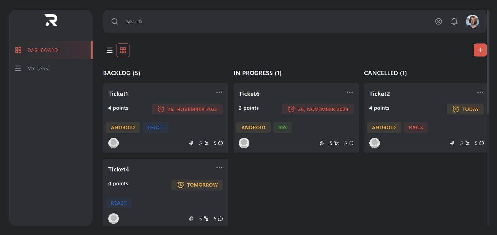

# 💻 Ravn Dashboard

## 🚀 Link to Deployed Application

https://ravn-dashboard.vercel.app/

## 📝 Project Description

The Ravn Dashboard is a dynamic, scalable application designed for managing tasks similar to those in Trello or Jira. Powered by Next.js 14, the application places a strong emphasis on server-side operations while selectively utilizing client-side rendering. It boasts robust features including seamless app routing, advanced image management, SEO optimization, and efficient caching capabilities, ensuring a powerful user experience.

## ⚙️ Setup/Running Instructions

To ensure optimal functionality, it's recommended to use `Node version 20.9.0` and `npm version 10.1.0.`

- _Install Dependencies_: Run `npm install` to install all necessary dependencies.
- _Development Mode_: Execute `npm run dev` to start the development server.
- _Production Environment_: Run `npm run build` and `npm run start` to build and start the production server.

#### Checks and Tests

- _Linter_: `npm run ci:lint`
- _Types_: `npm run ci:types`
- _Formatter_: `npm run ci:format`
- _Tests_: `npm run ci:tests`
- _Complete Check_: `npm run check`

#### Run documentation

- _Storybook_: `npm run storybook`
- _Typedoc_: `npm run typedoc`

## 📚 Running Storybook

To view and interact with the components library using Storybook, follow these simple steps:

1. **Run Storybook:** Once the dependencies are installed, start the Storybook development server:

   `npm run storybook`

2. **Access Storybook:** Open your browser and go to [http://localhost:6006/](http://localhost:6006/) to access the Storybook interface.

3. **Explore Components** Explore and interact with the components, view their states, and understand their usage within different scenarios.

## 📚 Running TypeDoc

To generate and view the documentation using TypeDoc, follow these steps:

1. **Run TypeDoc:** Once the dependencies are installed, execute the following command to generate the documentation:

   npm run typedoc

2. **Access Documentation:** After the documentation is generated, you can find the output in the docs or typedoc directory. Open the index.html file in a web browser to explore the documentation.

## 👨‍💻 Technologies/Libraries Used

- Core: Next.js, React, Apollo Client, GraphQL
- Styling: Tailwind CSS, clsx
- Testing: Jest, React Testing Library
- Linting/Formatting: ESLint, Prettier, Airbnb Style Guide
- Documentation: Storybook, Typedoc
- Others: date-fns, zod, react-icons, @apollo/experimental-nextjs-app-support

#### Additional Technologies:

- 🚀 **Deployment**: Integrated with **Vercel** for ease of use, Git integration, and additional features like image optimization.
- 🤖 **GitHub Actions**: Implemented for workflow management.

## 📁 Project Structure

The project follows a structured organization to maintain clarity and modularity. Here's an overview of the main folders:

- **node_modules:** The folder where npm installs project dependencies.

- **public:** Contains static assets like images or files that need to be served as-is.

- **src:** The heart of the project, containing the source code.

  - **actions:** Houses functions that run on the Next.js server.
  - **app:** Follows the Next.js architecture and contains the pages of the application.
  - **assets:** Holds various project assets such as images and svg's.
  - **components:** Reusable React components used throughout the application.
  - **data:** Contains enums and mocks used for data representation.
  - **gql:** A folder generated by Typedoc, saving types for GraphQL.
  - **hooks:** Custom React hooks used in the application.
  - **lib:** Holds configurations for libraries used in the project, in this case the Apollo Client configs.
  - **services:** Modules providing specific integrations for graphQL/Apollo interections.
  - **utils:** General utility functions and helper modules used throughout the application.

- **storybook-static:** this directory contain the static assets generated by Storybook.

## 🧠 Rationale for Decisions

- _Framework_: Opting for Next.js 14 was a strategic decision, driven by its extensive track record in real-world production, strong community backing, and cutting-edge features for future-proofing. Notably, Next.js 14 excels in server-side development and introduces a streamlined app router. By harnessing server-side rendering, the project gains performance and SEO advantages, while the app router simplifies code organization, paving the way for scalability and maintainability.
- _Folder Structure_: Adapted from a Web Dev Simplified model to maintain clarity and adaptability across various projects.
- _Server-Side Emphasis_: Utilized Next.js server-side capabilities extensively, with a focus on the app router for organizing pages and related functionalities.
- _Code Understanding_: Implemented Storybook and Typedoc for visual and functional documentation, ensuring code readability and maintainability.

### UI Overview

- Desktop

- Tablet

- Mobile

